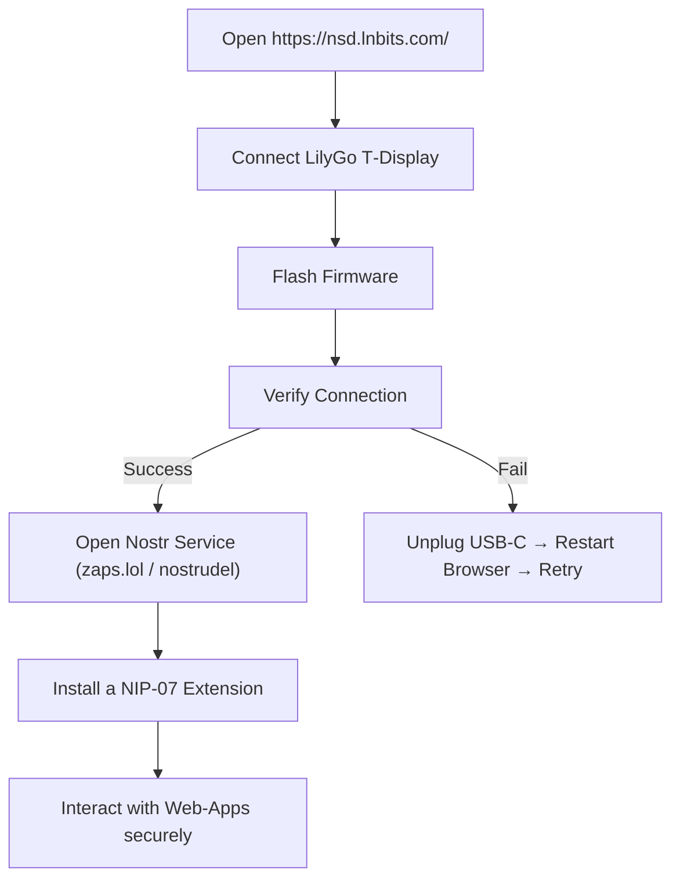

# Nostr & LilyGo T‑Display Setup  
### For Blockchain Developers  
*Quick start guide & useful extensions*  

---

# Why use a signing device / app?
- pasting your nsec is insecure, and dangerous
- nip-07 supports window.nostr capability for web browsers

---

## 1️⃣ Connect & Flash Firmware  

- **URL:** `https://nsd.lnbits.com/`  
- Plug the LilyGo **T‑Display** into USB‑C.  
- Click **Connect** → **Flash Firmware**.  
- **If it fails:**  
  1. Unplug the USB‑C cable.  
  2. Restart your browser.  
  3. Re‑connect and try again.  

---

## 2️⃣ Nostr Services & Tools  

| Service | What it does | Link |
|---------|--------------|------|
| **zaps.lol** | Web‑based NIP‑05 (nostr address) provider | https://zaps.lol |
| **nostrudel.ninja** | Manage profile (username, picture, etc.) | https://nostrudel.ninja |
| **nosta.me** | Micro‑app for onboarding new “Nostriches” | https://nosta.me |

---

## 3️⃣ LilyGo Device – T‑Display  

- **Hardware:** ESP32‑S3 based, 135 × 240 px TFT, USB‑C power. [t-display](https://lilygo.cc/products/lilygo%C2%AE-ttgo-t-display-1-14-inch-lcd-esp32-control-board?variant=42720264618165) 
- **Typical use‑cases:**  
  - On‑chain dashboards  
  - Real‑time Nostr feed displays  
  - QR‑code signing UI  

> *Investigate:* Can we reflash the firmware for an up‑to‑date via the **nsd.lnbits** flashing page and not overwrite existing.

---

## 4️⃣ Browser Extensions – Sign Nostr Events  

| Extension | Key Feature | Source |
|-----------|------------|--------|
| **keys.band** | Sign Nostr events directly in web‑apps (no key export). | Chrome Web Store |
| **nsec.app** | Non‑custodial key storage + remote signing. | GitHub (https://github.com/nostr‑tools/nsec.app) |
| **nos2x** | Similar to keys.band – injects a NIP‑07 provider. | Chrome Web Store |
| **nip‑07‑browser‑extensions** | Allow you to sign Nostr events on web-apps without having to give them your keys | [nip-07-browser-extensions](https://github.com/aljazceru/awesome-nostr#nip-07-browser-extensions) |

> **Why use them?**  
> - Keep private keys offline.  
> - Prevent phishing – the extension signs, not the site.  

---

## 5️⃣ Quick‑Start Flow (Dev‑Friendly)

---

